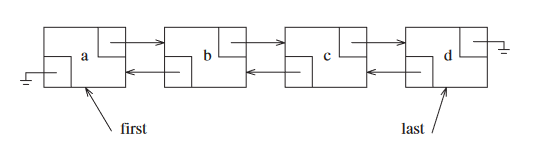

# Lists, Stacks and Queues

## Lists

Set of elements that use to follow the form of:
A0 -> A1 -> A3, ... -> A (N-1)
Being N the size of the list.

Examples of types of lists: Array, vector, Linked List, Double Linked List

## Stacks
A stack is a list with the restriction that insertions or deletions can only be done in on position, the end of the list (Usually named top of the list). It follows LIFO (Last in, First out)
Fundamental operations: pop and push (instert and delete).
Only the top element is accesible.

## Queue 
Opposite to stacks, it follows FIFO (First in, First out). 